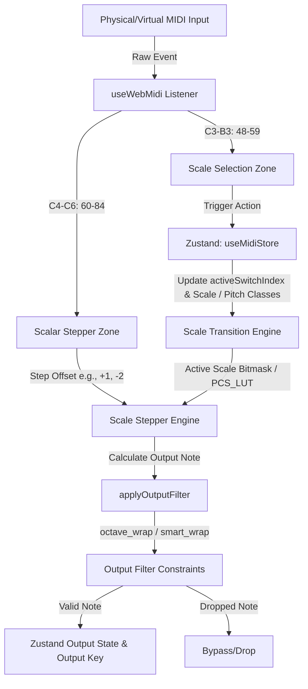

### FILE: project_tree.txt


/Users/vv2024/Documents/Repos - vv2024/MIDI/WebApps/midi-scale-stepper
├── # Prompts
|  ├── # 61.md
|  ├── # 62.md
|  ├── # 63.md
|  ├── WOs
|  |  └── MIDI-Scale-Stepper-MVP
|  |     ├── Phase_1
|  |     |  ├── 1-12_frontend-state.md
|  |     |  └── 1-1_workspace-setup.md
|  |     ├── Phase_2
|  |     |  ├── 2-10_test-engineer.md
|  |     |  └── 2-7_core-algorithm.md
|  |     ├── Phase_3
|  |     |  ├── 3-13_ui-coder.md
|  |     |  └── 3-14_styling-specialist.md
|  |     ├── Phase_4
|  |     |  └── 4-13_ui-coder.md
|  |     ├── Phase_5
|  |     |  └── 5-13_ui-coder.md
|  |     ├── Phase_6
|  |     |  ├── 6-13_ui-coder.md
|  |     |  └── 6-14_styling-specialist.md
|  |     └── _scorecard.md
|  └── xOlder
|     ├── # 0.md
|     ├── # 1.md
|     ├── # 10.md
|     ├── # 11.md
|     ├── # 12.md
|     ├── # 13.md
|     ├── # 14.md
|     ├── # 15.md
|     ├── # 16.md
|     ├── # 17.md
|     ├── # 18.md
|     ├── # 19.md
|     ├── # 2.md
|     ├── # 20.md
|     ├── # 21.md
|     ├── # 22.md
|     ├── # 23.md
|     ├── # 24.md
|     ├── # 25.md
|     ├── # 26.md
|     ├── # 27.md
|     ├── # 28.md
|     ├── # 29.md
|     ├── # 3.md
|     ├── # 30.md
|     ├── # 31.md
|     ├── # 32.md
|     ├── # 33.md
|     ├── # 34.md
|     ├── # 35.md
|     ├── # 36.md
|     ├── # 37.md
|     ├── # 38.md
|     ├── # 39.md
|     ├── # 4.md
|     ├── # 40.md
|     ├── # 41.md
|     ├── # 42.md
|     ├── # 43.md
|     ├── # 44.md
|     ├── # 45.md
|     ├── # 46.md
|     ├── # 47.md
|     ├── # 48.md
|     ├── # 49.md
|     ├── # 5.md
|     ├── # 50.md
|     ├── # 51.md
|     ├── # 52.md
|     ├── # 53.md
|     ├── # 54.md
|     ├── # 55.md
|     ├── # 56.md
|     ├── # 57.md
|     ├── # 58.md
|     ├── # 59.md
|     ├── # 6.md
|     ├── # 60.md
|     ├── # 7.md
|     ├── # 8.md
|     └── # 9.md
├── FONTS.md
├── PDD.md
├── PRD.md
├── PROJECT_CONTEXT_BUNDLE.md
├── PROJECT_STATE.md
├── README.md
├── index.html
├── llms.txt
├── package-lock.json
├── package.json
├── project_tree.txt
├── public
|  ├── PCS_LUT.dat
|  └── fonts
|     └── Bravura.woff2
├── src
|  ├── App.test.tsx
|  ├── App.tsx
|  ├── components
|  |  ├── Header.test.tsx
|  |  ├── Header.tsx
|  |  ├── HomeSettingsModal.tsx
|  |  ├── InfoModal.tsx
|  |  ├── InputSettingsModal.test.tsx
|  |  ├── InputSettingsModal.tsx
|  |  ├── KeySplitKeyboard.test-helper.ts
|  |  ├── KeySplitKeyboard.test.tsx
|  |  ├── KeySplitKeyboard.tsx
|  |  ├── KeySwitchContainer.test.tsx
|  |  ├── KeySwitchContainer.tsx
|  |  ├── NoteRangeFilterKeyboard.test.tsx
|  |  ├── NoteRangeFilterKeyboard.tsx
|  |  ├── PlayStartSettingsModal.test.tsx
|  |  ├── PlayStartSettingsModal.tsx
|  |  ├── ScaleChangeSettingsModal.test.tsx
|  |  ├── ScaleChangeSettingsModal.tsx
|  |  ├── ScaleInspectorNotation.test.tsx
|  |  ├── ScaleInspectorNotation.tsx
|  |  ├── ScaleKeySwitches12.test.tsx
|  |  ├── ScaleKeySwitches12.tsx
|  |  ├── ScaleStepperKeySwitches24.test.tsx
|  |  ├── ScaleStepperKeySwitches24.tsx
|  |  ├── SettingsModal.test.tsx
|  |  ├── SettingsModal.tsx
|  |  ├── StepperContextMenu.test.tsx
|  |  ├── StepperContextMenu.tsx
|  |  └── keyboardMap.ts
|  ├── hooks
|  |  ├── useSynth.ts
|  |  ├── useWebMidi.test.tsx
|  |  └── useWebMidi.ts
|  ├── index.css
|  ├── main.tsx
|  ├── store
|  |  ├── useMidiStore.test.ts
|  |  └── useMidiStore.ts
|  ├── test
|  |  └── setup.ts
|  ├── types
|  |  └── midi.ts
|  └── utils
|     ├── BitmaskCalculator.test.ts
|     ├── BitmaskCalculator.ts
|     ├── RoundingEngine.test.ts
|     ├── RoundingEngine.ts
|     ├── ScaleStepperEngine.test.ts
|     ├── ScaleStepperEngine.ts
|     ├── ScaleTransitionEngine.test.ts
|     ├── ScaleTransitionEngine.ts
|     ├── binaryLut.ts
|     ├── lutRegistry.ts
|     ├── notationMath.ts
|     └── scaleSpeller.ts
├── tsconfig.json
└── vite.config.ts

directory: 463 file: 3602

ignored: directory (69)




### FILE: PROJECT_STATE.md

# PROJECT_STATE.md

# Project State: MIDI Scale Stepper

## 1. Architecture & File Structure

The project directory structure is laid out as follows:

```
/Users/vv2024/Documents/Repos - vv2024/MIDI/WebApps/midi-scale-stepper
├── # Prompts
│   ├── # 61.md
│   ├── # 62.md
│   ├── # 63.md
│   ├── WOs
│   │   └── ...
│   └── xOlder
│       └── ...
├── FONTS.md
├── PDD.md
├── PRD.md
├── PROJECT_CONTEXT_BUNDLE.md
├── PROJECT_STATE.md
├── README.md
├── index.html
├── llms.txt
├── package-lock.json
├── package.json
├── project_tree.txt
├── public
│   ├── PCS_LUT.dat
│   └── fonts
│       └── Bravura.woff2
├── src
│   ├── App.test.tsx
│   ├── App.tsx
│   ├── components
│   │   ├── Header.test.tsx
│   │   ├── Header.tsx
│   │   ├── HomeSettingsModal.tsx
│   │   ├── InfoModal.tsx
│   │   ├── InputSettingsModal.test.tsx
│   │   ├── InputSettingsModal.tsx
│   │   ├── KeySplitKeyboard.test-helper.ts
│   │   ├── KeySplitKeyboard.test.tsx
│   │   ├── KeySplitKeyboard.tsx
│   │   ├── KeySwitchContainer.test.tsx
│   │   ├── KeySwitchContainer.tsx
│   │   ├── NoteRangeFilterKeyboard.test.tsx
│   │   ├── NoteRangeFilterKeyboard.tsx
│   │   ├── PlayStartSettingsModal.test.tsx
│   │   ├── PlayStartSettingsModal.tsx
│   │   ├── ScaleChangeSettingsModal.test.tsx
│   │   ├── ScaleChangeSettingsModal.tsx
│   │   ├── ScaleInspectorNotation.test.tsx
│   │   ├── ScaleInspectorNotation.tsx
│   │   ├── ScaleKeySwitches12.test.tsx
│   │   ├── ScaleKeySwitches12.tsx
│   │   ├── ScaleStepperKeySwitches24.test.tsx
│   │   ├── ScaleStepperKeySwitches24.tsx
│   │   ├── SettingsModal.test.tsx
│   │   ├── SettingsModal.tsx
│   │   ├── StepperContextMenu.test.tsx
│   │   ├── StepperContextMenu.tsx
│   │   └── keyboardMap.ts
│   ├── hooks
│   │   ├── useSynth.ts
│   │   ├── useWebMidi.test.tsx
│   │   └── useWebMidi.ts
│   ├── index.css
│   ├── main.tsx
│   ├── store
│   │   ├── useMidiStore.test.ts
│   │   └── useMidiStore.ts
│   ├── test
│   │   └── setup.ts
│   ├── types
│   │   └── midi.ts
│   └── utils
│       ├── BitmaskCalculator.test.ts
│       ├── BitmaskCalculator.ts
│       ├── RoundingEngine.test.ts
│       ├── RoundingEngine.ts
│       ├── ScaleStepperEngine.test.ts
│       ├── ScaleStepperEngine.ts
│       ├── ScaleTransitionEngine.test.ts
│       ├── ScaleTransitionEngine.ts
│       ├── binaryLut.ts
│       ├── lutRegistry.ts
│       ├── notationMath.ts
│       └── scaleSpeller.ts
├── tsconfig.json
└── vite.config.ts
```

## 2. Tech Stack

- **Core**: React 19, TypeScript 5.7, Vite 6.1
- **Styling**: TailwindCSS v4 (using vanilla CSS theme variables)
- **State Management**: Zustand 5.0
- **Testing**: Vitest 3.0, JSDOM 26, React Testing Library 16

## 3. Current System Capabilities

### Functional Modules
- **Audio Engine**: 
  - **MIDI Input Engine (`useWebMidi.ts`)**: Real-time MIDI interception with dual-zone support: C3-B3 for Scale Selection and C4-C6 for Stepper Zone. Includes staggered legato re-triggering prevention, note off ownership validation, and Play/Start output filtering. Supports configurable physical keyboard size truncation.
  - **Built-in Synth Engine (`useSynth.ts`)**: A lightweight Web Audio API triangle oscillator synth mapping the active MIDI output state to real-time audio playback.
- **Tracking Engine & Zustand Store (`useMidiStore.ts`)**: Global state coordinator handling scale indices, active switches, note history, boundary constraints, "First Note Exception" logic, scale presets synchronization, custom stepper configurations, and active key trackers.
- **Visualizer Modes**:
  - **Music Notation (`ScaleInspectorNotation.tsx`)**: Renders active scales/notes dynamically on a grand staff layout using the Bravura SMuFL font, styled with standardized Outfit, Inter, and Roboto Mono typography.
  - **Keyboard Components (`KeySplitKeyboard.tsx`, `NoteRangeFilterKeyboard.tsx`, `ScaleStepperKeySwitches24.tsx`, etc.)**: Provide interactive visual previews of active scales, keyboard splits, and range constraint filters.
- **UI State Logic & Settings Modals**: Custom settings modals (`SettingsModal.tsx`, `HomeSettingsModal.tsx`, `PlayStartSettingsModal.tsx`, `ScaleChangeSettingsModal.tsx`, `InputSettingsModal.tsx`) for user-level MIDI configurations, pitch filters, input keyboard sizes, and scale change behaviors (e.g. Follow Root vs Voice Leading).
- **Interactive Triggers & Context Menus**: `StepperContextMenu.tsx` allows right-click custom configurations for the 24 stepper keys (Step Offset, Octave Offset, Invert Toggle/Momentary, Home Reset, Repeat Last Action, Custom Bypass).

### Current Work-in-Progress / Status
- **Complete**: All features implemented. Zustand store sync, event routing, physical keyboard mapping, boundary filters, UI controls, and unit tests are complete and passing.

## 4. Recent Evolution

The project has recently completed critical improvements addressing:
1. **Typography Standardization**: Standardized fonts across the application to a cohesive design system using Google Fonts (Outfit for headers, Inter for UI text/labels, and Roboto Mono for intervals and tabular text).
2. **Keyboard Inversion Bug Fix**: Stripped inversion-awareness from `KeySplitKeyboard.tsx` handlers to make it a dumb physical controller passing raw index data, resolving the double-inversion bug.
3. **UI Layout Alignment**: Realigned the Octave Knob absolute positioning above the Play/Start zone using precise midpoint centering math relative to its layout margins.
4. **Input Size & Context Menus**: Added physical keyboard size truncation configurations (88-key vs 49-key modes) via `InputSettingsModal.tsx` and custom per-key action triggers (Invert, Octave, Reset, Repeat) via `StepperContextMenu.tsx`.
5. **Legato & Feedback Protection**: Extricated calculated notes from active physical key feedback and added note-off ownership validation.


### FILE: README.md

# MIDI Scale Stepper MVP

[](https://react.dev/)
[](https://github.com/pmndrs/zustand)
[](https://developer.mozilla.org/en-US/docs/Web/API/Web_MIDI_API)
[](https://www.typescriptlang.org/)

A professional, high-performance web-based MIDI routing and manipulation application. It intercepts raw MIDI messages in real-time, processes them through a deterministic **Scalar Stepper** engine using complex interval math, applies octave or smart transposition wrapping, and routes the filtered output to connected MIDI destination devices.

---

## 🎹 Core Architecture & Signal Flow

The application enforces a strict, unidirectional data flow to guarantee zero-latency processing without React lifecycle feedback loops:



1. **State Management (`useMidiStore`)**: Built on top of Zustand. All state mutations are driven by explicit event triggers (MIDI Note On/Off or UI clicks). We strictly avoid passive `useEffect` syncs to eliminate race conditions.
2. **Binary LUT (`PCS_LUT.dat`)**: Pitch Class Sets (PCS) are stored as decimal identifiers mapped to 12-bit binary representation in a compact database file `public/PCS_LUT.dat` and read once during initial boot.
3. **Output Routing**: Final calculated notes pass through output constraints (`octave_wrap` or `smart_wrap`) and are pushed directly to output key UI triggers and MIDI destination endpoints.

---

## 🕹️ MIDI Mapping Guide

The MIDI controller keys are mapped into two distinct functional zones:

| MIDI Range | Note Range | Function | Description |
|---|---|---|---|
| **48 - 59** | C3 - B3 | **Scale Select Zone** | Directly changes the active scale. Key switches are mapped to 12 user-configurable scales (e.g., Major, Dorian, Blues) loaded from the LUT database. |
| **60 - 84** | C4 - C6 | **Stepper Zone** | Triggers the Scalar Stepper engine. Plays a step offset (e.g., `-12` to `+12` steps) relative to the scale index of the last played MIDI note. |

---

## 🛡️ Output Constraint Filtering

Processed notes are passed through `applyOutputFilter` to constrain the output note inside the configured Pitch Filter Range (default: `21 - 108`, corresponding to A0 - C8 on a standard piano):

### 1. Octave Wrap (`octave_wrap`)
Constrains notes by transposing them in octaves (intervals of 12 semitones) until they lie inside the bounds. If a pitch class cannot fit into the bounds at any octave, the note is dropped.

### 2. Smart Wrap (`smart_wrap`)
Finds the pitch class (`pc`) of the note, and transposes it to the nearest matching pitch class inside the boundaries (typically anchoring near the edge boundaries). It guarantees the pitch class remains identical while forcing the note inside the specified range.

---

## 🛠️ Project Structure

```
.
├── FONTS.md                   # Typography documentation
├── PDD.md                     # Product Design Document
├── PRD.md                     # Product Requirements Document
├── PROJECT_STATE.md           # Project state and module description
├── README.md                  # Main developer documentation
├── index.html
├── llms.txt
├── package.json
├── project_tree.txt
├── public
│   ├── PCS_LUT.dat            # Binary Look-Up Table for Pitch Class Sets
│   └── fonts
│       └── Bravura.woff2      # Standard Music Notation Font
├── src
│   ├── App.tsx                # Main App entry and workspace shell
│   ├── components             # UI component library
│   │   ├── Header.tsx         # Connection info and global control
│   │   ├── HomeSettingsModal.tsx # Settings for MIDI mode selection
│   │   ├── InfoModal.tsx      # Application information and guide
│   │   ├── InputSettingsModal.tsx # Physical controller size configuration modal
│   │   ├── KeySplitKeyboard.tsx # Interactive visual keyboard split preview
│   │   ├── KeySwitchContainer.tsx # Swappable keyswitches/control zone
│   │   ├── NoteRangeFilterKeyboard.tsx # Note range constraint filter setup
│   │   ├── PlayStartSettingsModal.tsx # Settings for physical playback split zone
│   │   ├── ScaleChangeSettingsModal.tsx # Scale change behavior settings modal
│   │   ├── ScaleInspectorNotation.tsx # Music notation staff rendering
│   │   ├── ScaleKeySwitches12.tsx # 12 Key switches selector
│   │   ├── ScaleStepperKeySwitches24.tsx # 24 Stepper controls keyboard
│   │   ├── SettingsModal.tsx  # General and developer options
│   │   ├── StepperContextMenu.tsx # Context menu for mapping custom keyswitch actions
│   │   └── keyboardMap.ts
│   ├── hooks
│   │   ├── useSynth.ts        # Built-in synthesizer engine
│   │   └── useWebMidi.ts      # Web MIDI listener & dispatcher
│   ├── store
│   │   └── useMidiStore.ts    # Central Zustand store (State blueprint)
│   ├── types
│   │   └── midi.ts            # TypeScript interfaces and typings
│   └── utils
│       ├── BitmaskCalculator.ts # Bitmask/decimal conversion utils
│       ├── RoundingEngine.ts  # Key layout rounding calculations
│       ├── ScaleStepperEngine.ts # Core Stepper & filter calculation
│       ├── ScaleTransitionEngine.ts # Transition updates
│       └── lutRegistry.ts     # In-memory database holder
└── vite.config.ts
```

---

## 🚀 Setup & Installation

### Prerequisites
Make sure you have [Node.js](https://nodejs.org/) installed on your machine.

### Installation
1. Clone this repository to your local system.
2. Install the package dependencies:
   ```bash
   npm install
   ```

### Running Locally
Run the development server using:
   ```bash
   npm run dev
   ```

### Running Tests
Execute the comprehensive test suite with:
   ```bash
   npm run test
   ```

> [!IMPORTANT]
> Ensure that both `PCS_LUT.dat` and `fonts/Bravura.woff2` are correctly placed in the `public/` directory so they are served correctly in development and production bundles.


