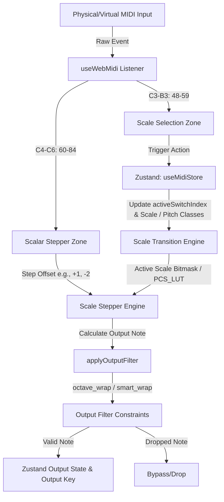

# MIDI Scale Stepper MVP

[](https://react.dev/)
[](https://github.com/pmndrs/zustand)
[](https://developer.mozilla.org/en-US/docs/Web/API/Web_MIDI_API)
[](https://www.typescriptlang.org/)

A professional, high-performance web-based MIDI routing and manipulation application. It intercepts raw MIDI messages in real-time, processes them through a deterministic **Scalar Stepper** engine using complex interval math, applies octave or smart transposition wrapping, and routes the filtered output to connected MIDI destination devices.

---

## 🎹 Core Architecture & Signal Flow

The application enforces a strict, unidirectional data flow to guarantee zero-latency processing without React lifecycle feedback loops:



1. **State Management (`useMidiStore`)**: Built on top of Zustand. All state mutations are driven by explicit event triggers (MIDI Note On/Off or UI clicks). We strictly avoid passive `useEffect` syncs to eliminate race conditions.
2. **Binary LUT (`PCS_LUT.dat`)**: Pitch Class Sets (PCS) are stored as decimal identifiers mapped to 12-bit binary representation in a compact database file `public/PCS_LUT.dat` and read once during initial boot.
3. **Output Routing**: Final calculated notes pass through output constraints (`octave_wrap` or `smart_wrap`) and are pushed directly to output key UI triggers and MIDI destination endpoints.

---

## 🕹️ MIDI Mapping Guide

The MIDI controller keys are mapped into two distinct functional zones:

| MIDI Range | Note Range | Function | Description |
|---|---|---|---|
| **48 - 59** | C3 - B3 | **Scale Select Zone** | Directly changes the active scale. Key switches are mapped to 12 user-configurable scales (e.g., Major, Dorian, Blues) loaded from the LUT database. |
| **60 - 84** | C4 - C6 | **Stepper Zone** | Triggers the Scalar Stepper engine. Plays a step offset (e.g., `-12` to `+12` steps) relative to the scale index of the last played MIDI note. |

---

## 🛡️ Output Constraint Filtering

Processed notes are passed through `applyOutputFilter` to constrain the output note inside the configured Pitch Filter Range (default: `21 - 108`, corresponding to A0 - C8 on a standard piano):

### 1. Octave Wrap (`octave_wrap`)
Constrains notes by transposing them in octaves (intervals of 12 semitones) until they lie inside the bounds. If a pitch class cannot fit into the bounds at any octave, the note is dropped.

### 2. Smart Wrap (`smart_wrap`)
Finds the pitch class (`pc`) of the note, and transposes it to the nearest matching pitch class inside the boundaries (typically anchoring near the edge boundaries). It guarantees the pitch class remains identical while forcing the note inside the specified range.

---

## 🛠️ Project Structure

```
.
├── PDD.md                     # Product Design Document
├── PRD.md                     # Product Requirements Document
├── PROJECT_STATE.md           # Project state and module description
├── README.md                  # Main developer documentation
├── index.html
├── package.json
├── public
│   ├── PCS_LUT.dat            # Binary Look-Up Table for Pitch Class Sets
│   └── fonts
│       └── Bravura.woff2      # Standard Music Notation Font
├── src
│   ├── App.tsx                # Main App entry and workspace shell
│   ├── components             # UI component library
│   │   ├── Header.tsx         # Connection info and global control
│   │   ├── HomeSettingsModal.tsx # Settings for MIDI mode selection
│   │   ├── InfoModal.tsx      # Application information and guide
│   │   ├── KeySplitKeyboard.tsx # Interactive visual keyboard split preview
│   │   ├── KeySwitchContainer.tsx # Swappable keyswitches/control zone
│   │   ├── NoteRangeFilterKeyboard.tsx # Note range constraint filter setup
│   │   ├── PlayStartSettingsModal.tsx # Settings for physical playback split zone
│   │   ├── ScaleInspectorNotation.tsx # Music notation staff rendering
│   │   ├── ScaleKeySwitches12.tsx # 12 Key switches selector
│   │   ├── ScaleStepperKeySwitches25.tsx # 25 Stepper controls keyboard
│   │   └── SettingsModal.tsx  # General and developer options
│   ├── hooks
│   │   ├── useSynth.ts        # Built-in synthesizer engine
│   │   └── useWebMidi.ts      # Web MIDI listener & dispatcher
│   ├── store
│   │   └── useMidiStore.ts    # Central Zustand store (State blueprint)
│   ├── types
│   │   └── midi.ts            # TypeScript interfaces and typings
│   └── utils
│       ├── BitmaskCalculator.ts # Bitmask/decimal conversion utils
│       ├── RoundingEngine.ts  # Key layout rounding calculations
│       ├── ScaleStepperEngine.ts # Core Stepper & filter calculation
│       ├── ScaleTransitionEngine.ts # Transition updates
│       └── lutRegistry.ts     # In-memory database holder
└── vite.config.ts
```

---

## 🚀 Setup & Installation

### Prerequisites
Make sure you have [Node.js](https://nodejs.org/) installed on your machine.

### Installation
1. Clone this repository to your local system.
2. Install the package dependencies:
   ```bash
   npm install
   ```

### Running Locally
Run the development server using:
   ```bash
   npm run dev
   ```

### Running Tests
Execute the comprehensive test suite with:
   ```bash
   npm run test
   ```

> [!IMPORTANT]
> Ensure that both `PCS_LUT.dat` and `fonts/Bravura.woff2` are correctly placed in the `public/` directory so they are served correctly in development and production bundles.
